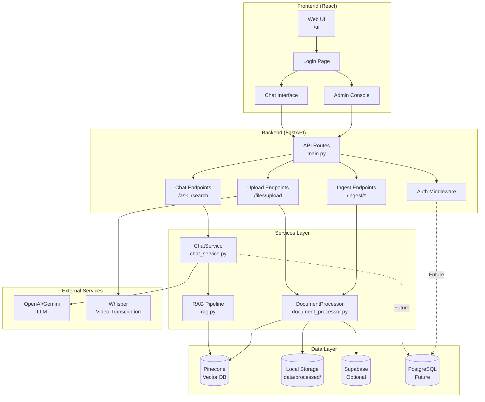
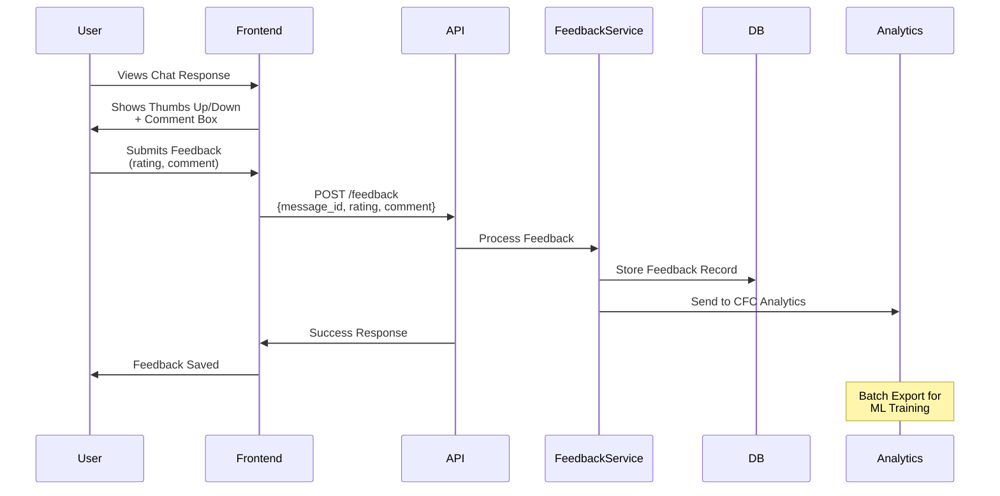
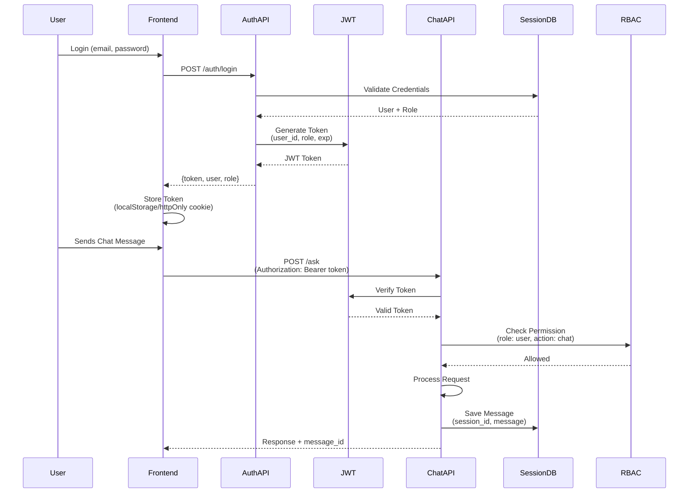
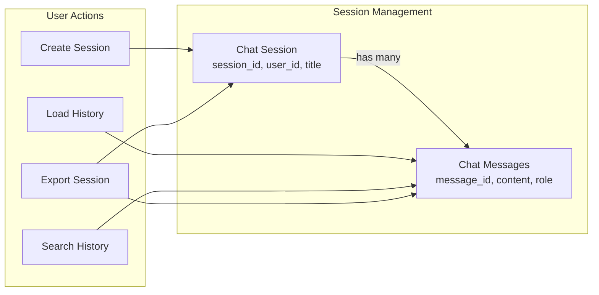
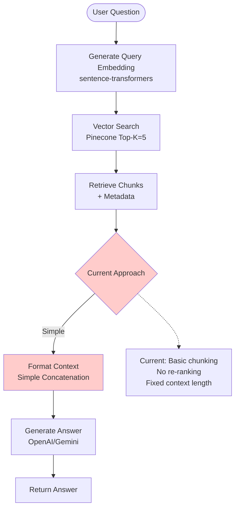
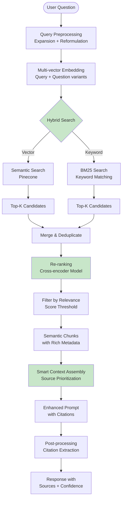
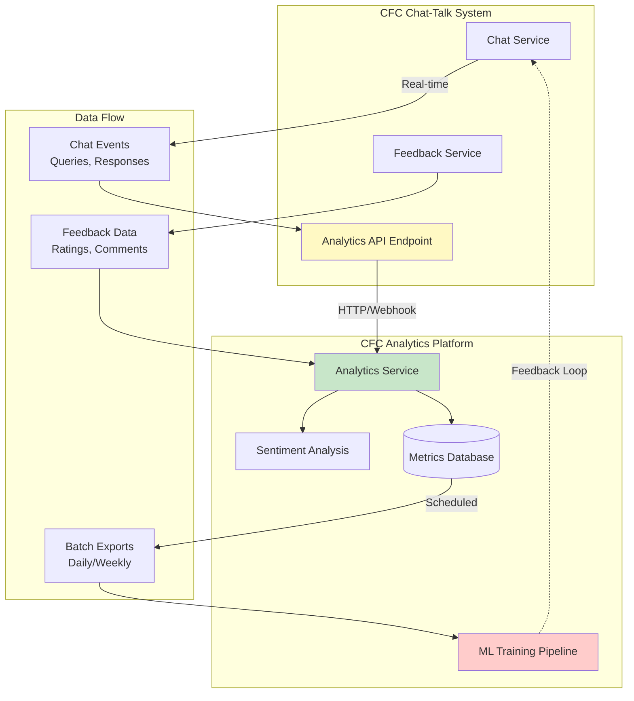
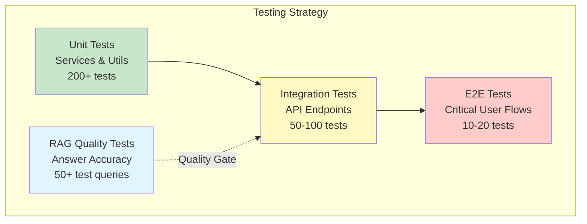
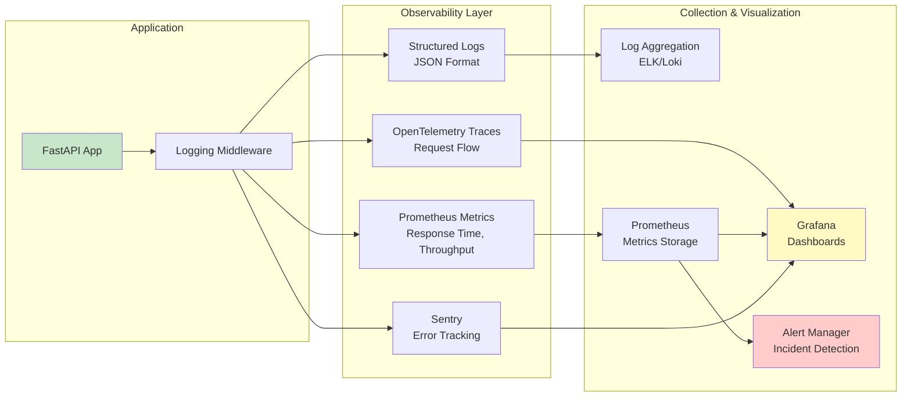
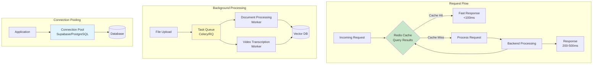

# CFC Chat-Talk Project Handover Document

## Executive Summary

This document provides a comprehensive technical handover for the CFC Chat-Talk project, a RAG-based chatbot system for CFC Technologies' animal feed software documentation. The system enables document ingestion, semantic search, and AI-powered Q&A capabilities through a FastAPI backend and React frontend.

**Current Status**: Functional MVP with core RAG pipeline, document processing, and basic UI. Ready for production enhancements in security, user management, feedback systems, and observability.

---

## 1. Requirements Analysis & Scope Baseline

### Current System Capabilities

#### **Supported Endpoints**

**Document Management:**
- `POST /files/upload` - Single file upload with auto-ingestion
- `POST /files/bulk` - Multiple file upload with batch processing
- `POST /ingest/document` - Process document by filename
- `POST /ingest/bulk` - Bulk process directory contents

**Search & Chat:**
- `POST /search` - Semantic document search (returns chunks with metadata)
- `POST /ask` - Q&A with AI-generated answers
- `POST /ask/video` - Video transcript-specific Q&A
- `POST /recommendations` - Content recommendations based on query

**System:**
- `GET /health` - Health check endpoint
- `GET /visibility/vector-store` - Pinecone index statistics
- `GET /content/images/{path:path}` - Image serving endpoint

**Video Processing:**
- `POST /api/videos/upload` - Video upload with Whisper transcription

#### **Dependencies**

**Backend:**
- FastAPI (web framework)
- Pinecone (vector database)
- sentence-transformers (embeddings: `all-MiniLM-L6-v2`)
- OpenAI/Gemini (LLM for answer generation)
- Supabase (optional storage backend)
- python-docx (document processing)
- openai-whisper (video transcription)

**Frontend:**
- React 18 (via CDN)
- Vanilla CSS (no framework)

**Key Files:**
- `main.py` (lines 1-98) - Application entry point, router registration
- `app/config.py` (lines 1-59) - Centralized configuration management
- `requirements.txt` - All Python dependencies

#### **Technical Direction**

**Current Architecture:**
- Monolithic FastAPI application with modular structure
- Vector search via Pinecone (separate indices for documents/videos)
- Local file storage with optional Supabase integration
- React SPA served as static files

**Expected Evolution:**
- Move to production-grade authentication (JWT/OAuth)
- Implement persistent chat history with database
- Add feedback collection for ML model improvement
- Integrate with CFC analytics systems
- Enhance RAG with better chunking strategies and metadata
- Add comprehensive testing and monitoring

**Important Files to Review:**
- `main.py` - See router registration (lines 56-61) for all endpoints
- `app/api/endpoints/chat.py` - Core chat/search endpoints (lines 26-281)
- `app/services/chat_service.py` - Business logic for Q&A (lines 81-165)
- `app/core/rag.py` - RAG pipeline implementation (lines 21-100)

### System Architecture Diagram



---

## 2. UI/UX & Information Architecture

### Current State

**User Flows:**

```mermaid
flowchart TD
    Start([User Opens App]) --> Login{Login Page}
    Login -->|Enter Email/Name| Validate{Email Validation}
    Validate -->|Invalid| Login
    Validate -->|Valid| CheckEmail{Check Email}
    
    CheckEmail -->|admin@cfctech.com| AdminPage[Admin Console]
    CheckEmail -->|dev@cfctech.com| DocsPage[Developer Docs]
    CheckEmail -->|Other| ChatPage[Chat Interface]
    
    AdminPage --> Upload[Upload File]
    Upload -->|Video| VideoUpload[Video Processing<br/>Whisper Transcription]
    Upload -->|Document| DocUpload[Document Ingestion]
    VideoUpload --> VectorDB[(Pinecone)]
    DocUpload --> VectorDB
    
    ChatPage --> AskQuestion[User Asks Question]
    AskQuestion --> API[POST /ask]
    API --> RAG[RAG Pipeline]
    RAG --> VectorDB
    RAG --> LLM[Generate Answer]
    LLM --> Display[Display Response<br/>+ Images/Videos]
    Display --> AskQuestion
    
    DocsPage --> APIDocs[API Documentation<br/>/docs]
    
    style Login fill:#e1f5ff
    style ChatPage fill:#c8e6c9
    style AdminPage fill:#fff9c4
    style DocsPage fill:#f3e5f5
```

1. **Login Flow** (`web/app.jsx` lines 362-452)
   - Simple email/name form with localStorage persistence
   - Route-based access: `admin@cfctech.com` → Admin, `dev@cfctech.com` → Docs, others → Chat
   - No backend validation

2. **Upload Flow** (`web/app.jsx` lines 806-1072)
   - Single file upload with progress tracking
   - Bulk upload with per-file status
   - Auto-detection of video vs document files
   - Visual feedback via progress bars and status pills

3. **Search/Chat Flow** (`web/app.jsx` lines 1074-1608)
   - Streaming text responses with typing indicators
   - Image and video embedding in responses
   - Markdown rendering for formatted text
   - Modal views for image/video previews

**Issues & Improvements Needed:**

1. **Navigation & Information Architecture**
   - No breadcrumbs or clear navigation hierarchy
   - Missing search history or saved queries
   - No document browser/explorer view
   - Chat history not persisted (lost on refresh)

2. **Visualization**
   - No source citations visible in chat responses
   - Missing confidence indicators for answers
   - No visual representation of document relationships
   - Image thumbnails not shown in search results

3. **Usability**
   - No keyboard shortcuts
   - Missing loading states for some operations
   - Error messages not user-friendly
   - No undo/redo for chat

**Key Files to Modify:**
- `web/app.jsx` (lines 1321-1515) - ChatPage component, add history persistence
- `web/app.jsx` (lines 1097-1210) - ChatMessage component, add source citations
- `web/app.jsx` (lines 194-273) - Layout component, add navigation menu
- `web/styles.css` - Add styles for new UI components

**Deliverables:**
- Persistent chat history with session management
- Source citation display in chat bubbles
- Document explorer sidebar
- Search history dropdown
- Confidence score indicators
- Improved error handling with user-friendly messages

---

## 3. Feedback & Rating System

### Current State

**Not Implemented** - No feedback mechanism exists.

### Feedback System Flow



### Requirements

**User Feedback Collection:**
- Thumbs up/down on responses
- Optional text comments
- Rating scale (1-5 stars)
- Flag incorrect answers
- Report missing information

**Data Model:**
```python
# Suggested schema (to be implemented)
{
    "feedback_id": "uuid",
    "session_id": "string",
    "message_id": "string",
    "question": "string",
    "answer": "string",
    "rating": int,  # 1-5 or -1/0/1
    "comment": "string",
    "timestamp": "datetime",
    "user_email": "string",
    "context_used": ["chunk_ids"],
    "confidence_score": float
}
```

**Key Files to Create/Modify:**
- `app/api/endpoints/feedback.py` - New endpoint file
- `app/api/models/requests.py` - Add FeedbackRequest model
- `app/api/models/responses.py` - Add FeedbackResponse model
- `app/services/feedback_service.py` - New service for feedback processing
- `web/app.jsx` (lines 1097-1210) - Add feedback buttons to ChatMessage
- Database migration script for feedback table (if using Supabase)

**Integration Points:**
- `app/services/chat_service.py` (line 147) - Return message_id with responses
- `app/api/endpoints/chat.py` (line 119) - Include message_id in AskResponse
- Frontend: Store message_id with each chat message for feedback association

**Deliverables:**
- `POST /feedback` endpoint for submitting ratings
- `GET /feedback/analytics` endpoint for admin dashboard
- Frontend feedback UI (thumbs up/down, comment box)
- Database schema for feedback storage
- Export functionality for ML training data

---

## 4. Chat History & Access Controls (RBAC)

### Current State

**Chat History:**
- Messages stored only in React state (`web/app.jsx` line 1322)
- Lost on page refresh
- No backend persistence
- No session management

**Access Controls:**
- Frontend-only role detection via email (`web/app.jsx` lines 97-103)
- No backend authentication
- No API-level authorization
- All endpoints publicly accessible

### Authentication & Session Flow



### Chat History Architecture



### Requirements

**Chat History:**
- Persistent storage in database (Supabase PostgreSQL recommended)
- Session-based conversation grouping
- User-specific history retrieval
- Export/import functionality
- Search within chat history

**RBAC Implementation:**
- JWT-based authentication
- Role-based permissions (Admin, Developer, User)
- API endpoint protection
- Resource-level access control (users can only see their own chats)

**Key Files to Create/Modify:**

**Backend:**
- `app/auth/` - New directory for authentication
  - `app/auth/jwt_handler.py` - JWT token generation/validation
  - `app/auth/dependencies.py` - FastAPI dependency for auth
  - `app/auth/rbac.py` - Role-based access control logic
- `app/api/endpoints/sessions.py` - New endpoint for chat sessions
- `app/services/chat_history_service.py` - New service for history management
- `app/api/endpoints/chat.py` (line 73) - Add auth dependency to `ask_question`
- `main.py` (line 47) - Update CORS to support credentials

**Frontend:**
- `web/app.jsx` (lines 1321-1515) - Add session management
- `web/app.jsx` (lines 1445-1515) - Save messages to backend after each exchange
- New component: `ChatHistorySidebar.jsx` - Display past conversations

**Database Schema:**
```sql
-- Sessions table
CREATE TABLE chat_sessions (
    session_id UUID PRIMARY KEY,
    user_email TEXT NOT NULL,
    created_at TIMESTAMP,
    updated_at TIMESTAMP,
    title TEXT
);

-- Messages table
CREATE TABLE chat_messages (
    message_id UUID PRIMARY KEY,
    session_id UUID REFERENCES chat_sessions,
    role TEXT, -- 'user' or 'assistant'
    content TEXT,
    metadata JSONB, -- context_used, confidence, etc.
    created_at TIMESTAMP
);
```

**Deliverables:**
- JWT authentication middleware
- `POST /auth/login` endpoint
- `GET /sessions` - List user's chat sessions
- `GET /sessions/{session_id}/messages` - Retrieve session history
- `POST /sessions` - Create new session
- `DELETE /sessions/{session_id}` - Delete session
- Frontend session management UI
- Protected API endpoints with role checks

---

## 5. Retrieval-Augmented Generation (RAG) Quality Upgrades

### Current RAG Pipeline Flow



### Enhanced RAG Pipeline (Proposed)



### Current State

**Chunking Strategy:**
- Fixed chunk size: 600 characters (`app/config.py` line 24)
- Overlap: 120 characters (`app/config.py` line 25)
- Simple text splitting without semantic awareness
- No metadata enrichment beyond basic fields

**Retrieval:**
- Top-K search (default: 5, `app/config.py` line 56)
- Cosine similarity in Pinecone
- Basic metadata filtering for video vs document
- No re-ranking or hybrid search

**Grounding:**
- Context formatting in `app/core/rag.py` (lines 81-100)
- Simple concatenation with separators
- No source prioritization
- Limited context length (4000 chars, line 57)

### Improvements Needed

**1. Enhanced Chunking:**
- Semantic chunking (sentence-aware, paragraph boundaries)
- Hierarchical chunking (document → section → paragraph)
- Metadata-rich chunks (section hierarchy, document type, importance)

**2. Better Retrieval:**
- Hybrid search (vector + keyword/BM25)
- Re-ranking with cross-encoder models
- Query expansion and reformulation
- Multi-vector retrieval (query + question embeddings)

**3. Improved Grounding:**
- Source citation with page/section numbers
- Confidence-weighted context assembly
- Dynamic context length based on query complexity
- Multi-hop retrieval for complex questions

**Key Files to Modify:**

**Chunking:**
- `app/utils/text_processing.py` - Enhance chunking logic
- `app/services/document_processor.py` - Add semantic chunking
- `app/config.py` (lines 23-25) - Make chunking configurable per document type

**Retrieval:**
- `app/core/rag.py` (lines 32-79) - Enhance `retrieve_context` method
- `app/services/chat_service.py` (lines 98-99) - Add re-ranking step
- `app/core/vector_store.py` (lines 54-77) - Support hybrid queries

**Grounding:**
- `app/core/rag.py` (lines 81-100) - Improve context formatting
- `app/services/chat_service.py` (lines 104-105) - Better context assembly
- `app/api/models/responses.py` - Add source citation fields

**Deliverables:**
- Semantic chunking implementation
- Hybrid search (vector + keyword)
- Re-ranking pipeline
- Enhanced metadata extraction
- Source citation in responses
- Configurable chunking strategies per document type

---

## 6. CFC System Integration

### Current State

**No Integration** - System operates in isolation.

### Integration Architecture



### Requirements

**Analytics Integration:**
- Send chat interactions to CFC analytics platform
- Track sentiment analysis on user questions
- Export feedback data for ML model training
- Monitor usage metrics (queries per user, popular topics)

**Integration Points:**
- Webhook/API calls to CFC analytics service
- Batch export of feedback data
- Real-time event streaming (optional)

**Key Files to Create/Modify:**

**Backend:**
- `app/services/cfc_analytics_service.py` - New service for external API calls
- `app/api/endpoints/chat.py` (line 76) - Add analytics call after answer generation
- `app/services/feedback_service.py` - Export feedback to CFC system
- `app/config.py` - Add CFC analytics API configuration

**Configuration:**
```python
# Add to app/config.py
CFC_ANALYTICS_API_URL: Optional[str] = os.getenv("CFC_ANALYTICS_API_URL")
CFC_ANALYTICS_API_KEY: Optional[str] = os.getenv("CFC_ANALYTICS_API_KEY")
```

**Deliverables:**
- `POST /analytics/event` endpoint for internal analytics
- Integration service for CFC analytics API
- Sentiment analysis on user queries
- Batch export endpoint for feedback data
- Usage metrics dashboard (admin-only)
- Webhook configuration for real-time events

---

## 7. Testing, Evaluation & Observability

### Testing Pyramid



### Observability Stack



### Current State

**Testing:**
- Basic unit tests in `tests/` directory
- `test_document_processor.py` - Document processing tests
- `test_text_processing.py` - Text utility tests
- `test_content_repository_utils.py` - Repository tests
- No integration tests
- No E2E tests
- No API endpoint tests

**Observability:**
- Basic logging via Python `logging` module
- No structured logging
- No metrics collection
- No distributed tracing
- No error tracking (Sentry, etc.)

### Requirements

**Testing:**
- Unit tests for all services (target: 80%+ coverage)
- Integration tests for API endpoints
- E2E tests for critical user flows
- Performance/load testing
- RAG quality evaluation suite

**Observability:**
- Structured logging (JSON format)
- Application metrics (Prometheus)
- Request tracing (OpenTelemetry)
- Error tracking (Sentry)
- Health check endpoints with detailed status
- Performance monitoring (response times, throughput)

**Key Files to Create/Modify:**

**Testing:**
- `tests/test_api_endpoints.py` - API endpoint tests
- `tests/test_chat_service.py` - Chat service tests
- `tests/test_rag_quality.py` - RAG evaluation tests
- `tests/conftest.py` - Pytest fixtures
- `pytest.ini` - Test configuration
- `.github/workflows/ci.yml` - CI/CD pipeline

**Observability:**
- `app/core/logging.py` - Structured logging setup
- `app/core/metrics.py` - Prometheus metrics
- `app/api/middleware/tracing.py` - OpenTelemetry middleware
- `app/api/endpoints/health.py` - Enhance health check (lines 1-50)
- `main.py` (line 26) - Configure structured logging

**Deliverables:**
- Comprehensive test suite (unit + integration)
- CI/CD pipeline with automated testing
- Structured logging with log aggregation
- Prometheus metrics endpoint
- Error tracking integration
- Performance monitoring dashboard
- RAG quality evaluation framework

---

## Additional Areas for Improvement

### 8. Performance Optimization

**Performance Architecture**



**Current Issues:**
- No caching for embeddings or frequent queries
- Synchronous document processing (blocks requests)
- No connection pooling for database
- Large file uploads may timeout

**Improvements:**
- Redis caching for query results
- Async document processing with background tasks
- Connection pooling for Supabase/PostgreSQL
- Chunked file uploads with resumable transfers

**Key Files:**
- `app/services/chat_service.py` - Add caching layer
- `app/api/endpoints/upload.py` - Implement async processing
- `app/core/cache.py` - New caching service

### 9. Security Enhancements

**Current Issues:**
- CORS allows all origins (`main.py` line 49)
- No rate limiting
- File uploads not validated
- No input sanitization

**Improvements:**
- Restrict CORS to specific domains
- Rate limiting per user/IP
- File type and size validation
- Input sanitization for user queries
- SQL injection prevention (if using raw SQL)

**Key Files:**
- `main.py` (line 47) - Update CORS configuration
- `app/rate_limit/` - Rate limiting middleware
- `app/api/endpoints/upload.py` (line 23) - Add file validation

### 10. Documentation & Developer Experience

**Current State:**
- Basic README
- Auto-generated API docs at `/docs`
- No architecture diagrams
- No contribution guidelines

**Improvements:**
- Comprehensive API documentation
- Architecture diagrams (Mermaid/PlantUML)
- Developer setup guide
- Contribution guidelines
- Code examples and tutorials

**Key Files:**
- `docs/ARCHITECTURE.md` - System architecture
- `docs/API.md` - API reference
- `docs/CONTRIBUTING.md` - Contribution guide
- `docs/DEVELOPMENT.md` - Development setup

---

## Quick Reference: Important Files by Feature

### Authentication & RBAC
- `app/auth/` (to be created)
- `main.py` (lines 47-53) - CORS configuration

### Chat History
- `app/services/chat_history_service.py` (to be created)
- `web/app.jsx` (lines 1321-1515) - ChatPage component

### Feedback System
- `app/api/endpoints/feedback.py` (to be created)
- `app/services/feedback_service.py` (to be created)

### RAG Pipeline
- `app/core/rag.py` (lines 21-100)
- `app/services/chat_service.py` (lines 81-165)
- `app/core/vector_store.py` (lines 54-77)

### Document Processing
- `app/services/document_processor.py`
- `app/api/endpoints/ingest.py` (lines 36-74)

### Frontend
- `web/app.jsx` - Main React application
- `web/styles.css` - Styling
- `web/index.html` - HTML entry point

### Configuration
- `app/config.py` - All settings
- `.env` - Environment variables (not in repo)

---

## Getting Started Checklist

1. **Environment Setup**
   - Copy `.env.example` to `.env`
   - Add Pinecone API key
   - Add OpenAI/Gemini API key (optional)
   - Add Supabase credentials (optional)

2. **Install Dependencies**
   ```bash
   pip install -r requirements.txt
   ```

3. **Run Application**
   ```bash
   uvicorn main:app --reload
   ```

4. **Access UI**
   - Frontend: http://localhost:8000/ui
   - API Docs: http://localhost:8000/docs

5. **Ingest Documents**
   - Upload via `/files/upload` or place files in `data/documents/`
   - Trigger ingestion via `/ingest/document` or `/ingest/bulk`

---

## Contact & Support

For questions or clarifications about this handover document, please refer to:
- Code comments in relevant files
- API documentation at `/docs` endpoint
- README.md for basic setup instructions

**Last Updated**: [Current Date]
**Project Version**: 1.0.0
**Maintained By**: [Team Name]

